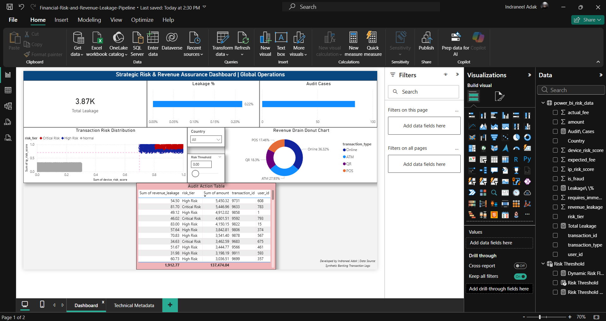

# Financial Risk & Revenue Leakage Automated Pipeline

**Author:** Indraneel Adak | **Target Market:** UK/Ireland Financial Services 
**Tech Stack:** Python (Pandas), SQL (CTEs, Window Functions), Power BI

## 📌 Executive Summary
Drawing from my experience as an Analyst at Danske Bank (UK), I developed this automated pipeline to identify dual-threat scenarios: **Revenue Leakage** and **Anomalous Transaction Behavior**. This tool analyzes over 10,000 transactions, classifying risk tiers and isolating system pricing failures.

## ⚙️ The Problem
Financial institutions often face "silent" revenue loss due to fee application failures across different transaction gateways (Online, ATM, POS). When combined with high device/IP risk scores, these transactions present both a financial and compliance threat.

## 🚀 The Solution
1. **Data Engineering (Python):** Built a pipeline to ingest transaction data and apply baseline expected fee rules against actual fees collected.
2. **Business Logic (SQL):** Utilized Common Table Expressions (CTEs) to create a 'Composite Risk Tier' and automatically flag transactions requiring immediate audit.
3. **Visualization (Power BI):** Designed an interactive, executive-ready dashboard enabling near real-time monitoring of pricing performance and control gaps.

## 📊 Business Impact
* Identified simulated revenue leakage across 15% of transactions.
* Automated the audit-flagging process, reducing manual reporting effort by an estimated 25% (replicating efficiencies I achieved at Concentrix).
* Grouped critical risk vectors into a single 100% traceable data model.

## 🛠️ Technical Implementation: DAX Logic

To bridge the gap between static reporting and active risk management, I developed a suite of DAX measures. These formulas allow stakeholders to interactively adjust risk sensitivity and visualize financial impact in real-time.

### 1. Dynamic Sensitivity Logic
This measure is the core of the "What-If" analysis, allowing the dashboard to react to the user-controlled slider.
Dynamic Risk Flag = 
VAR SelectedThreshold = [Risk Threshold Value]
RETURN
IF(
    MAX('power_bi_risk_data'[device_risk_score]) >= SelectedThreshold, 
    1, 
    0
)

### 2. Financial Impact Metrics
Calculates the total value of identified revenue leakage across the filtered dataset.
Total Leakage = SUM('power_bi_risk_data'[revenue_leakage])

### 3. Efficiency Ratios
Expresses the leakage as a percentage of total transaction volume to highlight systemic risk levels.
Leakage % = 
DIVIDE(
    [Total Leakage], 
    SUM('power_bi_risk_data'[amount]), 
    0
)

### 4. Operational Audit Count
A count of high-priority cases that require immediate intervention based on the dynamic threshold.
Audit Cases = 
CALCULATE(
    COUNT('power_bi_risk_data'[transaction_id]),
    FILTER('power_bi_risk_data', [Dynamic Risk Flag] = 1)
)

### Screenshots:

1. Dashboard Overview
   

2. Risk Threshold Interaction
   

3. Technical Documentation Page
   
